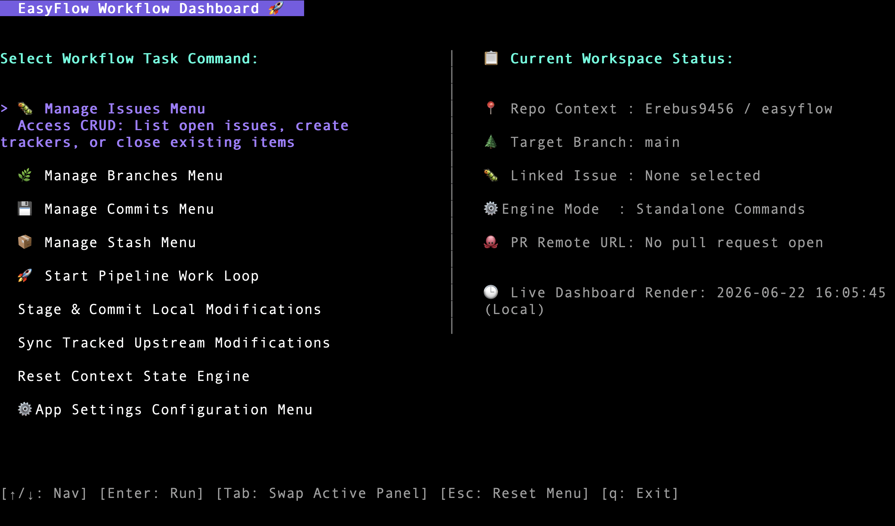

<div align="center">

# 🚀EasyFlow

**Terminal-first GitHub workflow automation — built in Go.**

Replace your browser, your manual git commands, and your context switching with a single interactive UI that drives your entire development loop.

[](https://go.dev)
[](LICENSE)
[](https://github.com/Erebus9456/easyflow/releases)
[](https://github.com/Erebus9456/easyflow/stargazers)

<br />



</div>

---

## What is EasyFlow?

Most development workflows are split across three places: your terminal for git, your browser for GitHub, and your head to track where you are in the process.

EasyFlow collapses all three into one keyboard-driven terminal UI. You pick an issue, and EasyFlow walks you through every step — branch, commits, push, PR, merge, close — without you ever leaving the terminal.

```
Issue → Branch → Code → Commit → Push → PR → Merge → Close Issue
```

---

## Installation

**Using `go install`:**

```bash
go install github.com/Erebus9456/easyflow@latest
```

**Build from source:**

```bash
git clone https://github.com/Erebus9456/easyflow.git
cd easyflow
go build -o easyflow .
```

**Prerequisites:**
- Go 1.22+
- [GitHub CLI (`gh`)](https://cli.github.com/) — authenticated with `gh auth login`
- Git

---

## Quick Start

```bash
# Inside any GitHub repo
easyflow
```

Use arrow keys to navigate, `Enter` to select, `q` to quit.

```
┌─ EasyFlow ────────────────────────────────┐
│                                           │
│  > Start Work                             │
│    Create Branch                          │
│    Commit Changes                         │
│    Push                                   │
│    Create PR                              │
│    Merge PR                               │
│    Close Issue                            │
│                                           │
│  ↑↓ navigate   enter select   q quit      │
└───────────────────────────────────────────┘
```

Selecting **Start Work** launches the full guided flow:

1. Fetches open GitHub issues from your repo
2. You pick one
3. A branch is created and checked out automatically
4. You code — come back when ready
5. Stage, commit, and push from inside the UI
6. PR is created with the issue linked
7. Merge and issue close happen in one step

---

## Tech Stack

| Layer | Tool | Role |
|-------|------|------|
| Language | [Go](https://go.dev) | Core runtime |
| UI Engine | [Bubble Tea](https://github.com/charmbracelet/bubbletea) | TUI framework |
| Components | [Bubbles](https://github.com/charmbracelet/bubbles) | Inputs, lists, spinners |
| Styling | [Lip Gloss](https://github.com/charmbracelet/lipgloss) | Terminal layout & color |
| CLI | [Cobra](https://github.com/spf13/cobra) | Command entrypoint |
| GitHub | [GitHub CLI (`gh`)](https://cli.github.com/) | Issues, PRs, repos |
| Git | Git | Branch, commit, push |

---

## Project Structure

```
easyflow/
├── main.go                  # Entry point
├── cmd/
│   └── root.go              # Cobra CLI bootstrap
├── internal/
│   ├── ui/
│   │   ├── model.go         # Application state
│   │   ├── update.go        # Input handling & transitions
│   │   ├── view.go          # Terminal rendering
│   │   ├── menu.go          # Menu definitions
│   │   └── styles.go        # Lip Gloss styling
│   ├── workflow/
│   │   ├── workflow.go      # Full lifecycle orchestration
│   │   └── state.go         # Runtime workflow state
│   ├── github/
│   │   ├── issues.go        # Issue fetch, select, close
│   │   └── pr.go            # PR create, merge, view
│   ├── git/
│   │   ├── branch.go        # Branch create & switch
│   │   ├── commit.go        # Stage & commit
│   │   └── push.go          # Push with upstream
│   └── config/
│       └── config.go        # User preferences
└── utils/
    ├── shell.go             # Command execution
    └── errors.go            # Error handling
```

---

## Documentation

| Doc | Description |
|-----|-------------|
| [Architecture Overview](docs/architecture.md) | System design and component relationships |
| [Module Documentation](docs/modules.md) | Detailed docs for each package |
| [Workflow Guide](docs/workflow.md) | Full workflow automation guide |
| [API Reference](docs/api.md) | Function and type references |

---

## Roadmap

- [x] Full guided workflow (Issue → Close)
- [x] GitHub CLI integration
- [x] Interactive Bubble Tea UI
- [ ] Multi-repo support 
- [ ] Config profiles per repo
- [ ] Custom keyboard shortcuts
- [ ] AI-generated commit messages
- [ ] AI-generated PR descriptions
- [ ] Sprint planning mode

---

## Contributing

Contributions are welcome. Please open an issue before submitting a pull request so we can discuss the change.

```bash
# Fork → clone → create a branch
git checkout -b feat/your-feature

# Make changes, then open a PR
```


---

## License

MIT © [Erebus9456](https://github.com/Erebus9456)
