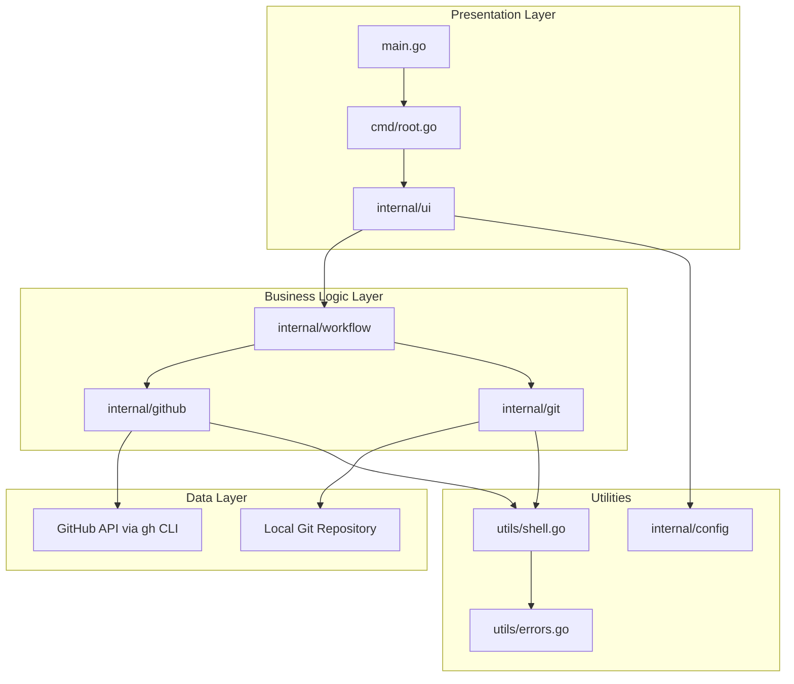
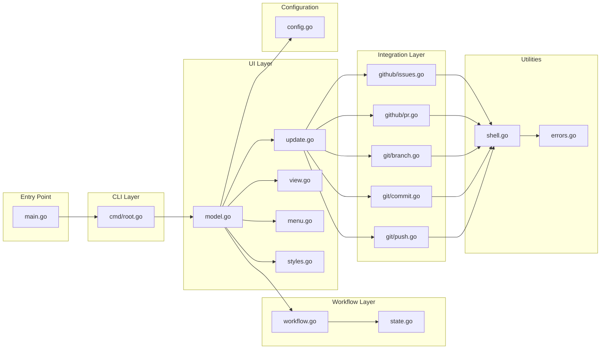
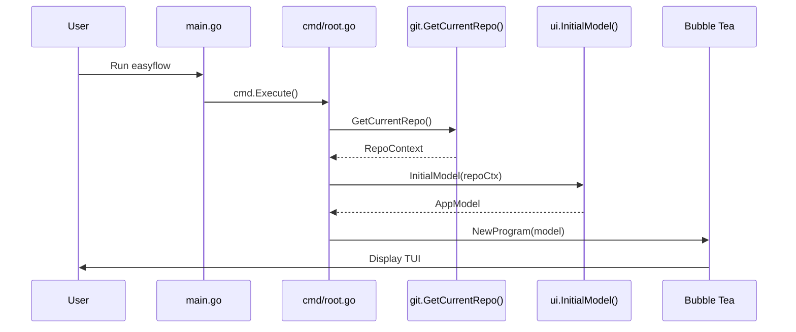
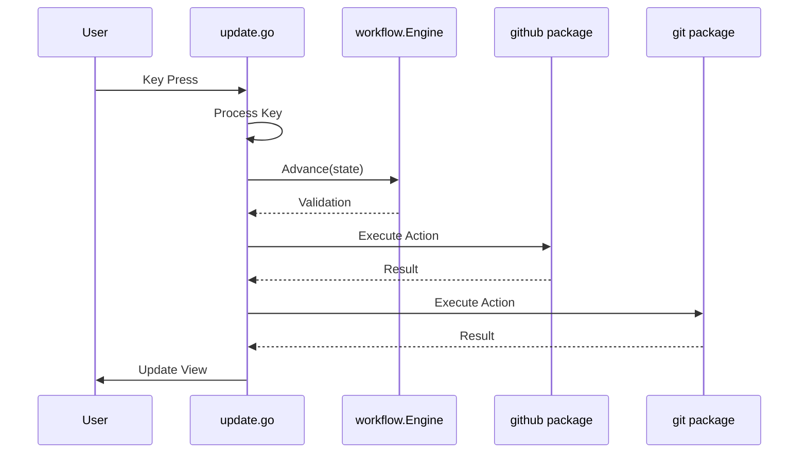
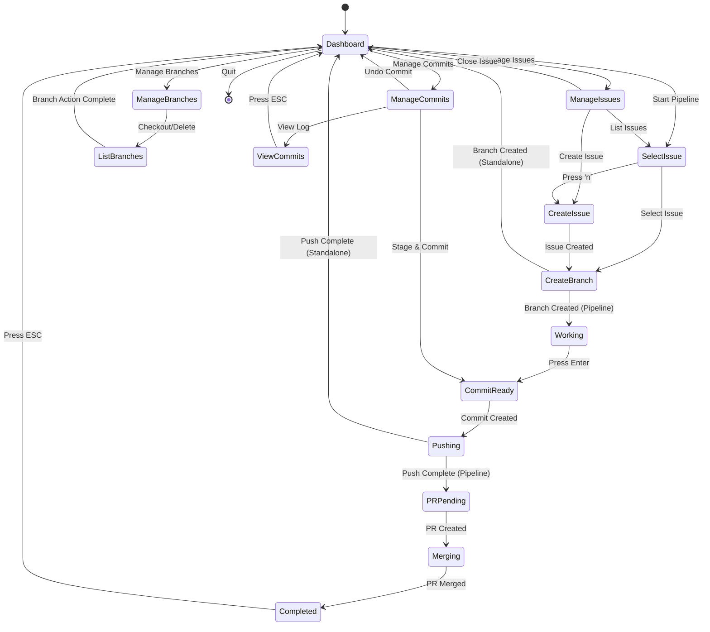
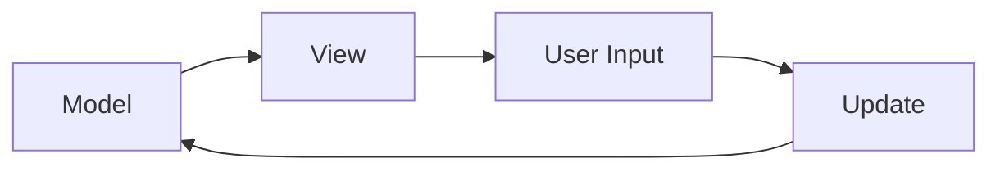
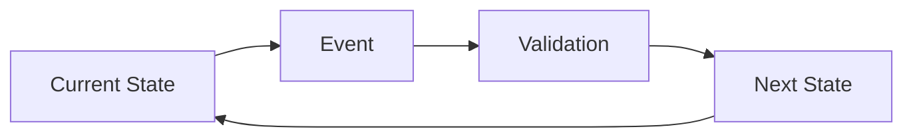
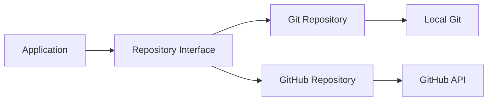
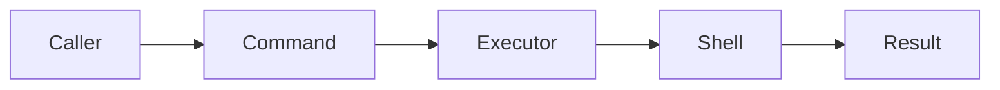

# Architecture Overview

This document provides a comprehensive overview of the EasyFlow system architecture, including component relationships, data flow, and design patterns.

## Table of Contents

- [High-Level Architecture](#high-level-architecture)
- [Component Diagram](#component-diagram)
- [Data Flow](#data-flow)
- [State Machine](#state-machine)
- [Package Structure](#package-structure)
- [Design Patterns](#design-patterns)
- [Technology Stack](#technology-stack)

## High-Level Architecture

EasyFlow follows a layered architecture pattern with clear separation of concerns:



### Architecture Layers

1. **Presentation Layer**: Handles user interaction and UI rendering
2. **Business Logic Layer**: Manages workflow state and orchestration
3. **Data Layer**: Interacts with external systems (GitHub, Git)
4. **Utilities**: Provides common functionality (shell execution, error handling)

## Component Diagram



## Data Flow

### Application Startup Flow



### User Interaction Flow



## State Machine

EasyFlow uses a state machine pattern to manage workflow progression:



### State Definitions

| State | Description | Entry Condition |
|-------|-------------|-----------------|
| `StateDashboard` | Main menu display | Application start or reset |
| `StateSelectIssue` | Issue selection for pipeline | User starts pipeline |
| `StateCreateIssue` | New issue creation | User creates new issue |
| `StateCreateBranch` | Branch naming | Issue selected |
| `StateWorking` | Code editing phase | Branch created |
| `StateCommitReady` | Commit message input | User finishes coding |
| `StatePushing` | Pushing to remote | Commit created |
| `StatePRPending` | PR creation input | Push complete |
| `StateMerging` | Merge authorization | PR created |
| `StateCompleted` | Pipeline completion | Merge complete |
| `StateManageIssues` | Issue management submenu | User selects issues menu |
| `StateManageBranches` | Branch management submenu | User selects branches menu |
| `StateManageCommits` | Commit management submenu | User selects commits menu |
| `StateListBranches` | Branch selection list | User chooses checkout/delete |
| `StateViewCommits` | Commit log display | User views history |

## Package Structure

```
easyflow/
├── main.go                          # Application entry point
├── cmd/
│   └── root.go                      # CLI command definition
├── internal/
│   ├── ui/                          # Presentation layer
│   │   ├── model.go                 # Application state model
│   │   ├── update.go                # Event handling logic
│   │   ├── view.go                  # UI rendering
│   │   ├── menu.go                  # Menu definitions
│   │   └── styles.go                # Visual styling
│   ├── workflow/                    # Business logic layer
│   │   ├── workflow.go              # Workflow engine
│   │   └── state.go                 # State definitions
│   ├── github/                      # GitHub integration
│   │   ├── issues.go                # Issue management
│   │   └── pr.go                    # Pull request management
│   ├── git/                         # Git operations
│   │   ├── branch.go                # Branch management
│   │   ├── commit.go                # Commit operations
│   │   └── push.go                  # Push operations
│   └── config/                      # Configuration
│       └── config.go                # Layout and settings
├── utils/                           # Utilities
│   ├── shell.go                     # Command execution
│   └── errors.go                    # Error definitions
└── docs/                            # Documentation
```

### Package Responsibilities

#### `internal/ui`
- **Purpose**: Terminal User Interface using Bubble Tea
- **Key Components**:
  - `model.go`: Central state management
  - `update.go`: Event handling and state transitions
  - `view.go`: UI rendering and layout
  - `menu.go`: Menu structure and options
  - `styles.go`: Visual styling and theming

#### `internal/workflow`
- **Purpose**: Workflow orchestration and state management
- **Key Components**:
  - `workflow.go`: Workflow engine with validation
  - `state.go`: State definitions and runtime context

#### `internal/github`
- **Purpose**: GitHub API integration via CLI
- **Key Components**:
  - `issues.go`: Issue CRUD operations
  - `pr.go`: Pull request operations

#### `internal/git`
- **Purpose**: Git repository operations
- **Key Components**:
  - `branch.go`: Branch management
  - `commit.go`: Commit operations
  - `push.go`: Remote synchronization

#### `internal/config`
- **Purpose**: Application configuration
- **Key Components**:
  - `config.go`: Layout settings and preferences

#### `utils`
- **Purpose**: Shared utilities
- **Key Components**:
  - `shell.go`: Command execution wrapper
  - `errors.go`: Standardized error definitions

## Design Patterns

### 1. Model-View-Update (MVU) Pattern

EasyFlow uses the MVU pattern, which is the core of Bubble Tea:



- **Model**: `AppModel` in `model.go` - holds application state
- **View**: `View()` method in `view.go` - renders UI based on state
- **Update**: `Update()` method in `update.go` - processes events and updates state

### 2. State Machine Pattern

The workflow engine implements a state machine:



- **States**: Defined in `state.go`
- **Transitions**: Managed by `workflow.go`
- **Validation**: Ensures legal state transitions

### 3. Repository Pattern

Git and GitHub operations abstract external system interactions:



### 4. Command Pattern

Shell commands are encapsulated in reusable functions:



## Technology Stack

### Core Technologies

| Technology | Version | Purpose |
|------------|---------|---------|
| **Go** | 1.21+ | Core language |
| **Bubble Tea** | Latest | TUI framework |
| **Lip Gloss** | Latest | Styling engine |
| **Bubbles** | Latest | UI components |
| **Cobra** | Latest | CLI framework |

### External Dependencies

| Dependency | Purpose |
|------------|---------|
| **GitHub CLI (gh)** | GitHub API operations |
| **Git** | Version control operations |

### Architecture Decisions

#### Why Bubble Tea?
- **Terminal-first**: Aligns with developer workflow
- **Keyboard-driven**: Fast, efficient interaction
- **Cross-platform**: Works on macOS, Linux, Windows
- **Composable**: Modular component system

#### Why GitHub CLI?
- **Official**: Maintained by GitHub
- **Authenticated**: Reuses existing auth
- **Feature-rich**: Comprehensive API coverage
- **Reliable**: Battle-tested at scale

#### Why State Machine?
- **Predictable**: Clear state transitions
- **Validatable**: Prevents invalid operations
- **Debuggable**: Easy to trace execution
- **Extensible**: Simple to add new states

## Component Interaction Matrix

| Component | ui | workflow | github | git | config | utils |
|-----------|-----|----------|--------|-----|--------|-------|
| **ui** | - | ✓ | ✓ | ✓ | ✓ | - |
| **workflow** | ✓ | - | - | - | - | - |
| **github** | - | - | - | - | - | ✓ |
| **git** | - | - | - | - | - | ✓ |
| **config** | - | - | - | - | - | - |
| **utils** | - | - | ✓ | ✓ | - | - |

## Data Structures

### RuntimeContext
```go
type RuntimeContext struct {
    ActiveIssueNumber int
    ActiveIssueTitle  string
    BranchName        string
    PullRequestURL    string
    CurrentStep       State
    PipelineMode      bool
}
```

### AppModel
```go
type AppModel struct {
    Engine      *workflow.Engine
    RepoCtx     *git.RepoContext
    MenuItems   []MainMenuItem
    Cursor      int
    Issues      []github.Issue
    IssueCursor int
    Layout      config.LayoutConfig
    TextInput   textinput.Model
    Spinner     spinner.Model
    Loading     bool
    ErrorMessage string
    SuccessMsg   string
}
```

## Security Considerations

1. **Authentication**: Uses GitHub CLI's existing authentication
2. **Command Injection**: All commands use parameterized execution
3. **Error Handling**: Comprehensive error handling prevents information leakage
4. **State Validation**: Workflow engine validates all state transitions

## Performance Considerations

1. **Async Operations**: Uses Bubble Tea's async message system
2. **Lazy Loading**: Issues and branches loaded on demand
3. **Minimal State**: Only essential data kept in memory
4. **Efficient Rendering**: Only changed components re-rendered

## Extensibility Points

1. **New States**: Add to `state.go` and update workflow
2. **New Menu Items**: Add to `menu.go`
3. **New Git Operations**: Add to `git/` package
4. **New GitHub Operations**: Add to `github/` package
5. **Custom Styles**: Modify `styles.go`

---

**Related Documentation**:
- [Module Documentation](modules.md) - Detailed component documentation
- [Workflow Guide](workflow.md) - Workflow state machine details
- [API Reference](api.md) - Complete API documentation
