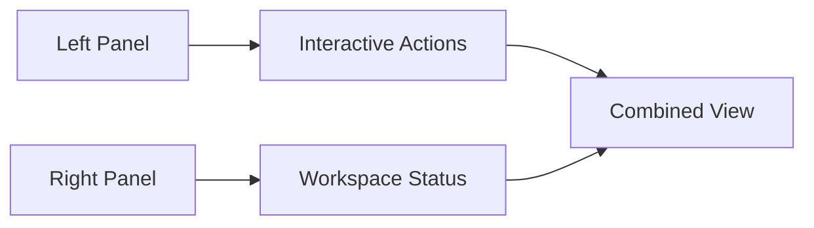
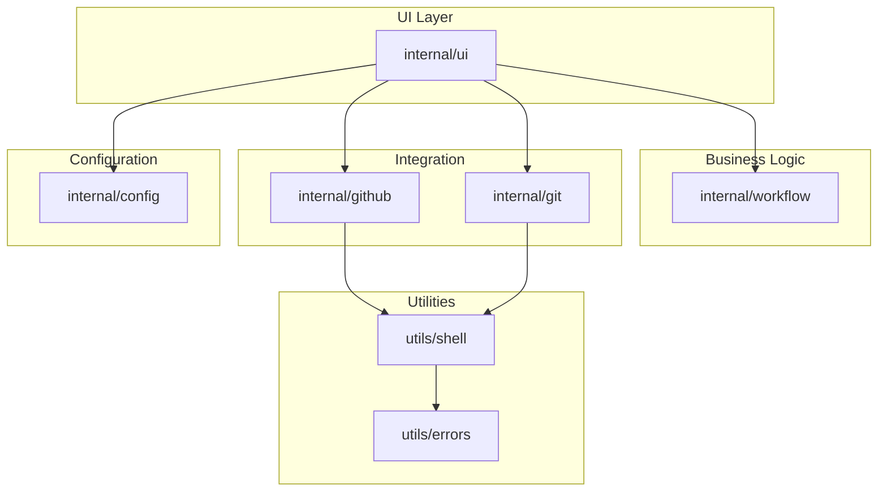
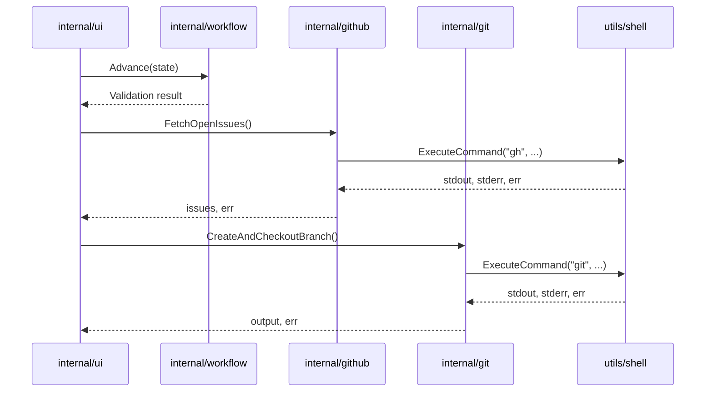

# Module Documentation

This document provides detailed documentation for each internal package in the EasyFlow project.

## Table of Contents

- [UI Module (`internal/ui`)](#ui-module-internalui)
- [Workflow Module (`internal/workflow`)](#workflow-module-internalworkflow)
- [GitHub Module (`internal/github`)](#github-module-internalgithub)
- [Git Module (`internal/git`)](#git-module-internalgit)
- [Config Module (`internal/config`)](#config-module-internalconfig)
- [Utilities Module (`utils`)](#utilities-module-utils)

---

## UI Module (`internal/ui`)

The UI module is responsible for the terminal user interface using the Bubble Tea framework.

### Package Structure

```
internal/ui/
├── model.go      # Application state model
├── update.go     # Event handling and state transitions
├── view.go       # UI rendering and layout
├── menu.go       # Menu definitions and options
└── styles.go     # Visual styling and theming
```

### Core Components

#### `model.go`

**Purpose**: Central state management for the application.

**Key Types**:

```go
type AppModel struct {
    Engine      *workflow.Engine      // Workflow orchestration engine
    RepoCtx     *git.RepoContext     // Repository context information
    MenuItems   []MainMenuItem       // Available menu options
    Cursor      int                   // Current menu selection
    Issues      []github.Issue        // Fetched issues list
    IssueCursor int                   // Current issue selection
    Layout      config.LayoutConfig   // UI layout configuration
    TextInput   textinput.Model       // Text input component
    Spinner     spinner.Model         // Loading spinner
    Loading     bool                  // Loading state flag
    ErrorMessage string               // Error message display
    SuccessMsg   string               // Success message display
}
```

**Key Functions**:

- `InitialModel(repo *git.RepoContext) AppModel` - Creates initial application state
- `Init() tea.Cmd` - Initializes subcomponents (blinking cursor, spinner)

**Responsibilities**:
- Maintains application state
- Stores user selections and context
- Manages UI component lifecycle
- Tracks loading and error states

#### `update.go`

**Purpose**: Handles all keyboard input and state transitions.

**Key Message Types**:

```go
type issuesMsg []github.Issue    // Async issue fetch result
type branchesMsg []string        // Async branch list result
type commitsMsg []string         // Async commit log result
type errMsg error                // Async error result
type actionSuccessMsg string     // Async action success result
```

**Key Functions**:

- `Update(msg tea.Msg) (tea.Model, tea.Cmd)` - Main update loop
- `handleMenuSelection() (tea.Model, tea.Cmd)` - Menu selection handler

**State Handling**:

The update function routes messages based on current workflow state:

| State | Input Handling |
|-------|---------------|
| `StateDashboard` | Menu navigation (↑/↓, Enter) |
| `StateManageIssues` | Issue submenu navigation |
| `StateManageBranches` | Branch submenu navigation |
| `StateManageCommits` | Commit submenu navigation |
| `StateSelectIssue` | Issue selection, creation |
| `StateCreateIssue` | Issue title input |
| `StateCreateBranch` | Branch name input |
| `StateCommitReady` | Commit message input |
| `StatePRPending` | PR title input |
| `StateMerging` | Merge authorization |

**Key Bindings**:
- `↑/↓` or `j/k` - Navigate menus
- `Enter` - Select option/advance
- `Esc` - Return to dashboard
- `q` or `Ctrl+C` - Quit application
- `n` - Create new issue (in issue selection)

#### `view.go`

**Purpose**: Renders the terminal UI based on current state.

**Layout Structure**:

The UI uses a two-column layout:



**Key Functions**:

- `View() string` - Main view renderer

**Panel Contents**:

**Left Panel** (Interactive Actions):
- Dashboard menu
- Submenu options (issues, branches, commits)
- Selection lists (issues, branches, commits)
- Input fields (issue title, branch name, commit message)
- Status messages (working, pushing, merging)

**Right Panel** (Workspace Status):
- Repository context (owner/repo)
- Current branch
- Linked issue
- Engine mode (pipeline/standalone)
- PR URL
- Live timestamp

**Dynamic Styling**:
- Uses `LayoutConfig` for spacing and column width
- Responsive to terminal size
- Color-coded states (success, error, neutral)

#### `menu.go`

**Purpose**: Defines menu structure and options.

**Key Types**:

```go
type MainMenuItem struct {
    Title       string  // Menu item title
    Description string  // Menu item description
}
```

**Key Functions**:

- `GetMainMenuOptions() []MainMenuItem` - Returns main menu items
- `GetSubMenuOptions(category string) []MainMenuItem` - Returns submenu items

**Main Menu Options**:

1. 🐛 Manage Issues Menu - Access CRUD for issues
2. 🌿 Manage Branches Menu - Access CRUD for branches
3. 💾 Manage Commits Menu - Access CRUD for commits
4. 🚀 Start Pipeline Work Loop - Automated workflow
5. Stage & Commit Local Modifications - Manual commit
6. Sync Tracked Upstream Modifications - Manual push
7. Reset Context State Engine - Clear state

**Submenu Categories**:

**Issues**:
- List Repository Issues
- Create Tracker Issue
- Close Issue by Number

**Branches**:
- Select / Checkout Existing Branch
- Create Custom Local Branch
- Delete Local Working Branch

**Commits**:
- View Recent Commit Log
- Stage & Commit Modifications
- Undo Last Local Commit

#### `styles.go`

**Purpose**: Visual styling and theming system.

**Color Palette**:

```go
var (
    ColorPrimary   = lipgloss.Color("#8633FF")  // Vibrant Purple
    ColorSecondary = lipgloss.Color("#00F5D4")  // Bright Aqua
    ColorSuccess   = lipgloss.Color("#70E000")  // Lime Green
    ColorError     = lipgloss.Color("#FF0054")  // Deep Red
    ColorNeutral   = lipgloss.Color("#3A3A3A")  // Slate Gray
    ColorTextMuted = lipgloss.Color("#757575")  // Muted Label Gray
)
```

**Style Definitions**:

- `StyleTitle` - Main title banner
- `StyleHeader` - Section headers
- `StyleSelectedOption` - Highlighted menu items
- `StyleUnselectedOption` - Normal menu items
- `StyleSuccessBanner` - Success message banner
- `StyleErrorBanner` - Error message banner
- `StyleHelpText` - Help and hint text

**Usage**:
All styles use Lip Gloss for consistent, beautiful terminal styling.

---

## Workflow Module (`internal/workflow`)

The workflow module orchestrates the application state machine and validates transitions.

### Package Structure

```
internal/workflow/
├── workflow.go   # Workflow engine
└── state.go      # State definitions
```

### Core Components

#### `workflow.go`

**Purpose**: Workflow orchestration engine with state validation.

**Key Types**:

```go
type Engine struct {
    Ctx *RuntimeContext  // Runtime context
}

type RuntimeContext struct {
    ActiveIssueNumber int
    ActiveIssueTitle  string
    BranchName        string
    PullRequestURL    string
    CurrentStep       State
    PipelineMode      bool
}
```

**Key Functions**:

- `NewEngine() *Engine` - Creates new workflow engine
- `Advance(next State) error` - Transitions to next state with validation
- `Reset()` - Clears context and returns to dashboard

**State Validation Rules**:

```go
case StateCreateBranch:
    if e.Ctx.ActiveIssueNumber == 0 {
        return fmt.Errorf("cannot initialize branch mapping: no issue selected")
    }
case StateCommitReady:
    if e.Ctx.BranchName == "" {
        return fmt.Errorf("cannot prepare commit: no working branch active")
    }
case StatePRPending:
    if e.Ctx.BranchName == "" {
        return fmt.Errorf("cannot initiate PR build sequence: missing working branch")
    }
case StateMerging:
    if e.Ctx.PullRequestURL == "" {
        return fmt.Errorf("cannot merge: no pull request URL detected")
    }
```

**Responsibilities**:
- Manages state transitions
- Validates preconditions for each state
- Maintains runtime context
- Supports pipeline and standalone modes

#### `state.go`

**Purpose**: Defines all workflow states and runtime context.

**State Constants**:

```go
const (
    StateDashboard State = iota      // Main menu
    StateSelectIssue                  // Issue selection
    StateCreateIssue                  // Issue creation
    StateCreateBranch                 // Branch creation
    StateWorking                      // Code editing
    StateCommitReady                  // Commit preparation
    StatePushing                      // Pushing to remote
    StatePRPending                    // PR creation
    StateMerging                      // Merge authorization
    StateCompleted                    // Pipeline complete
    
    // CRUD Submenu States
    StateManageIssues                 // Issue management
    StateManageBranches              // Branch management
    StateManageCommits               // Commit management
    
    // Action States
    StateListBranches                // Branch list display
    StateViewCommits                 // Commit log display
)
```

**RuntimeContext Fields**:

| Field | Type | Purpose |
|-------|------|---------|
| `ActiveIssueNumber` | int | Currently selected issue ID |
| `ActiveIssueTitle` | string | Currently selected issue title |
| `BranchName` | string | Current working branch |
| `PullRequestURL` | string | Created PR URL |
| `CurrentStep` | State | Current workflow state |
| `PipelineMode` | bool | Continuous pipeline mode flag |

**Key Functions**:

- `NewRuntimeContext() *RuntimeContext` - Creates default context

---

## GitHub Module (`internal/github`)

The GitHub module handles all GitHub API interactions via the GitHub CLI.

### Package Structure

```
internal/github/
├── issues.go   # Issue management
└── pr.go       # Pull request management
```

### Core Components

#### `issues.go`

**Purpose**: GitHub Issue CRUD operations.

**Key Types**:

```go
type Issue struct {
    Number int    `json:"number"`
    Title  string `json:"title"`
    Body   string `json:"body"`
}
```

**Key Functions**:

- `FetchOpenIssues() ([]Issue, error)` - Fetches open issues from repository
- `CloseIssue(number int) error` - Closes an issue by number
- `CreateIssue(title string) (int, error)` - Creates a new issue

**GitHub CLI Commands Used**:

```bash
gh issue list --state open --json number,title,body
gh issue close <number>
gh issue create --title <title> --body <body>
```

**Error Handling**:
- Validates issue title is not empty
- Parses issue number from URL output
- Returns descriptive errors for failures

**Usage Example**:

```go
issues, err := github.FetchOpenIssues()
if err != nil {
    return fmt.Errorf("failed to fetch issues: %w", err)
}

issueNum, err := github.CreateIssue("Fix authentication bug")
if err != nil {
    return fmt.Errorf("failed to create issue: %w", err)
}

err = github.CloseIssue(issueNum)
if err != nil {
    return fmt.Errorf("failed to close issue: %w", err)
}
```

#### `pr.go`

**Purpose**: Pull request operations.

**Key Functions**:

- `CreatePullRequest(title, body string) (string, error)` - Creates a new PR
- `MergeAndCleanupPR() (string, error)` - Merges PR and deletes branch

**GitHub CLI Commands Used**:

```bash
gh pr create --title <title> --body <body>
gh pr merge --merge --delete-branch
```

**Parameters**:

- `title`: PR title (required)
- `body`: PR description body
- Returns: PR URL on success

**Merge Behavior**:
- Uses merge commit strategy
- Automatically deletes remote branch after merge
- Returns merge output

**Usage Example**:

```go
url, err := github.CreatePullRequest("Fix auth bug", "Closes #123")
if err != nil {
    return fmt.Errorf("failed to create PR: %w", err)
}

output, err := github.MergeAndCleanupPR()
if err != nil {
    return fmt.Errorf("failed to merge PR: %w", err)
}
```

---

## Git Module (`internal/git`)

The Git module handles all local Git repository operations.

### Package Structure

```
internal/git/
├── branch.go   # Branch management
├── commit.go   # Commit operations
└── push.go     # Push operations
```

### Core Components

#### `branch.go`

**Purpose**: Branch management operations.

**Key Functions**:

- `SanitizeBranchName(input string) string` - Cleans branch name for Git
- `CreateAndCheckoutBranch(name string) (string, error)` - Creates and switches to branch
- `ListLocalBranches() ([]string, error)` - Lists all local branches
- `CheckoutBranch(name string) error` - Switches to existing branch
- `DeleteLocalBranch(name string) error` - Deletes a local branch

**Sanitization Rules**:

- Converts to lowercase
- Replaces spaces with hyphens
- Removes invalid characters: `*`, `?`, `~`, `^`, `:`, `\`

**Git Commands Used**:

```bash
git checkout -b <name>
git branch --format=%(refname:short)
git checkout <name>
git branch -d <name>
```

**Error Handling**:
- Validates branch name is not empty
- Returns descriptive errors for Git failures
- Uses safe deletion flag (`-d`) to prevent data loss

**Usage Example**:

```go
// Create and checkout branch
output, err := git.CreateAndCheckoutBranch("feature-auth-fix")
if err != nil {
    return fmt.Errorf("failed to create branch: %w", err)
}

// List branches
branches, err := git.ListLocalBranches()
if err != nil {
    return fmt.Errorf("failed to list branches: %w", err)
}

// Checkout existing branch
err = git.CheckoutBranch("main")
if err != nil {
    return fmt.Errorf("failed to checkout: %w", err)
}

// Delete branch
err = git.DeleteLocalBranch("old-feature")
if err != nil {
    return fmt.Errorf("failed to delete branch: %w", err)
}
```

#### `commit.go`

**Purpose**: Commit operations and history.

**Key Functions**:

- `StageAllChanges() error` - Stages all changes (git add .)
- `CreateCommit(message string) (string, error)` - Creates commit with message
- `GetLocalCommitLog(count int) ([]string, error)` - Gets recent commit history
- `UndoLastCommit() error` - Undoes last commit (soft reset)

**Git Commands Used**:

```bash
git add .
git commit -m <message>
git log -n <count> --oneline
git reset --soft HEAD~1
```

**Parameters**:

- `message`: Commit message (required, non-empty)
- `count`: Number of commits to retrieve

**Error Handling**:
- Validates commit message is not empty
- Returns commit output on success
- Soft reset preserves local changes

**Usage Example**:

```go
// Stage all changes
err := git.StageAllChanges()
if err != nil {
    return fmt.Errorf("failed to stage: %w", err)
}

// Create commit
output, err := git.CreateCommit("Fix authentication bug")
if err != nil {
    return fmt.Errorf("failed to commit: %w", err)
}

// Get recent commits
logs, err := git.GetLocalCommitLog(5)
if err != nil {
    return fmt.Errorf("failed to get log: %w", err)
}

// Undo last commit
err = git.UndoLastCommit()
if err != nil {
    return fmt.Errorf("failed to undo: %w", err)
}
```

#### `push.go`

**Purpose**: Push local changes to remote repository.

**Key Functions**:

- `PushToRemote() (string, error)` - Pushes current branch with upstream tracking

**Git Commands Used**:

```bash
git push -u origin HEAD
```

**Behavior**:
- Pushes current branch to remote
- Sets upstream tracking automatically
- Returns push output on success

**Error Handling**:
- Returns descriptive errors for push failures
- Captures stderr for debugging

**Usage Example**:

```go
output, err := git.PushToRemote()
if err != nil {
    return fmt.Errorf("failed to push: %w", err)
}
fmt.Println("Push successful:", output)
```

---

## Config Module (`internal/config`)

The config module manages application configuration and layout settings.

### Package Structure

```
internal/config/
└── config.go   # Configuration definitions
```

### Core Components

#### `config.go`

**Purpose**: Application configuration and UI layout settings.

**Key Types**:

```go
type Config struct {
    DefaultBranch string  // Future: Default branch name
}

type LayoutConfig struct {
    MenuSpacing int  // Number of newlines between menu items
    ColumnWidth int  // Width of UI columns
}
```

**Key Functions**:

- `DefaultLayout() LayoutConfig` - Returns default layout configuration

**Default Layout Values**:

```go
LayoutConfig{
    MenuSpacing: 4,   // Relaxed spacing between menu items
    ColumnWidth: 50,  // Standard column width for split layout
}
```

**Customization**:

Users can modify these values to adjust UI appearance:
- `MenuSpacing`: 1 for tight, 2 for relaxed, 4 for spacious
- `ColumnWidth`: Adjust based on terminal size

**Future Extensions**:

The `Config` struct is prepared for future features:
- Default branch name
- Commit message style preferences
- GitHub username
- Workflow preferences

---

## Utilities Module (`utils`)

The utils module provides shared utility functions for command execution and error handling.

### Package Structure

```
utils/
├── shell.go   # Command execution
└── errors.go  # Error definitions
```

### Core Components

#### `shell.go`

**Purpose**: Safe command execution with output capture.

**Key Functions**:

- `ExecuteCommand(name string, args ...string) (string, string, error)` - Executes shell command

**Parameters**:

- `name`: Command name (e.g., "git", "gh")
- `args`: Command arguments

**Returns**:

- `stdout`: Command standard output (trimmed)
- `stderr`: Command standard error (trimmed)
- `error`: Execution error if any

**Implementation**:

```go
func ExecuteCommand(name string, args ...string) (string, string, error) {
    var stdout, stderr bytes.Buffer
    
    cmd := exec.Command(name, args...)
    cmd.Stdout = &stdout
    cmd.Stderr = &stderr
    
    err := cmd.Run()
    
    return strings.TrimSpace(stdout.String()), 
           strings.TrimSpace(stderr.String()), 
           err
}
```

**Features**:
- Captures both stdout and stderr
- Trims whitespace from output
- Returns error for non-zero exit codes
- Safe parameter passing (no shell injection)

**Usage Example**:

```go
stdout, stderr, err := utils.ExecuteCommand("git", "branch", "--list")
if err != nil {
    fmt.Printf("Error: %s\n", stderr)
    return err
}
fmt.Println("Branches:", stdout)
```

#### `errors.go`

**Purpose**: Standardized error definitions for common failure scenarios.

**Error Types**:

```go
var (
    ErrGitNotFound         = errors.New("git binary not found on your system PATH")
    ErrGitHubCLINotFound  = errors.New("github cli (gh) binary not found on your system PATH")
    ErrNotAGitRepository   = errors.New("not a git repository (or any of the parent directories)")
    ErrNoRemoteOrigin      = errors.New("git remote 'origin' is missing or not configured")
    ErrGitHubAuthMissing   = errors.New("gh cli is not authenticated. run 'gh auth login' first")
)
```

**Error Descriptions**:

| Error | Description | Resolution |
|-------|-------------|------------|
| `ErrGitNotFound` | Git not installed | Install Git |
| `ErrGitHubCLINotFound` | GitHub CLI not installed | Install `gh` CLI |
| `ErrNotAGitRepository` | Not in a git repo | Run inside git repository |
| `ErrNoRemoteOrigin` | No remote configured | Add git remote |
| `ErrGitHubAuthMissing` | Not authenticated | Run `gh auth login` |

**Usage Example**:

```go
if err != nil {
    if errors.Is(err, utils.ErrGitNotFound) {
        fmt.Println("Please install Git first")
    } else if errors.Is(err, utils.ErrGitHubAuthMissing) {
        fmt.Println("Please run: gh auth login")
    }
    return err
}
```

---

## Module Dependencies



## Data Flow Between Modules



---

**Related Documentation**:
- [Architecture Overview](architecture.md) - System architecture and design
- [Workflow Guide](workflow.md) - Workflow state machine details
- [API Reference](api.md) - Complete API documentation
