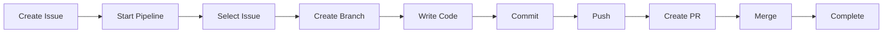
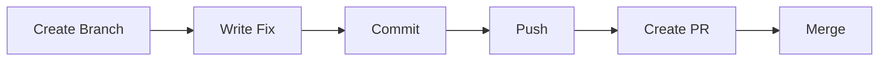
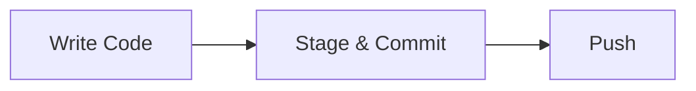

# Quick Start Guide

Get started with EasyFlow in minutes. This guide will walk you through the basics of using EasyFlow to automate your GitHub workflow.

## Table of Contents

- [What You'll Learn](#what-youll-learn)
- [Prerequisites](#prerequisites)
- [5-Minute Quick Start](#5-minute-quick-start)
- [Basic Workflow](#basic-workflow)
- [Common Tasks](#common-tasks)
- [Next Steps](#next-steps)

---

## What You'll Learn

In this guide, you'll learn how to:

- Run EasyFlow for the first time
- Navigate the interface
- Complete a basic workflow
- Perform common operations

---

## Prerequisites

Before starting, ensure you have:

1. **EasyFlow installed** - Follow the [Installation Guide](installation.md)
2. **Git repository** - Navigate to a Git repository with GitHub remote
3. **GitHub CLI authenticated** - Run `gh auth login` if needed

---

## 5-Minute Quick Start

### Step 1: Navigate to Your Repository

```bash
cd /path/to/your/git/repository
```

### Step 2: Run EasyFlow

```bash
easyflow
```

You'll see the EasyFlow dashboard:

```
┌─────────────────────────────────────────────────────────────┐
│                    EasyFlow Workflow Dashboard 🚀            │
├─────────────────────────────────────────────────────────────┤
│                                                             │
│  Select Workflow Task Command:                              │
│                                                             │
│  > 🐛 Manage Issues Menu                                    │
│    Access CRUD: List open issues, create trackers, or       │
│    close existing items                                     │
│                                                             │
│    🌿 Manage Branches Menu                                  │
│    Access CRUD: Checkout existing, create custom, or        │
│    drop local branches                                      │
│                                                             │
│    💾 Manage Commits Menu                                   │
│    Access CRUD: View mini git log history, stage           │
│    everything, or undo check-ins                            │
│                                                             │
│    🚀 Start Pipeline Work Loop                              │
│    Automated loop: Select Issue ➔ Branch ➔ Commit ➔       │
│    Push ➔ PR ➔ Merge                                       │
│                                                             │
│  ┌───────────────────────────────────────────────────────┐  │
│  │ 📋 Current Workspace Status:                        │  │
│  │                                                       │  │
│  │ 📍 Repo Context : owner/repo                         │  │
│  │ 🌲 Target Branch: main                              │  │
│  │ 🐛 Linked Issue : None selected                     │  │
│  │ ⚙️ Engine Mode  : Standalone Commands               │  │
│  │ 🐙 PR Remote URL: No pull request open               │  │
│  └───────────────────────────────────────────────────────┘  │
│                                                             │
│  [↑/↓ or j/k: Nav]  [Enter: Select/Advance]  [Esc: Reset]  │
└─────────────────────────────────────────────────────────────┘
```

### Step 3: Explore the Interface

Use the keyboard to navigate:

- **↑/↓** or **j/k** - Move up/down through menu items
- **Enter** - Select the highlighted option
- **Esc** - Return to dashboard or reset state
- **q** or **Ctrl+C** - Quit EasyFlow

---

## Basic Workflow

Let's walk through a complete workflow: creating an issue, fixing it, and merging the changes.

### Scenario: Fix a Bug

#### 1. Create an Issue

From the dashboard:

1. Navigate to "🐛 Manage Issues Menu"
2. Press Enter
3. Navigate to "Create Tracker Issue"
4. Press Enter
5. Enter issue title: `Fix login button not responding`
6. Press Enter

EasyFlow creates the issue and displays the issue number.

#### 2. Create a Branch

EasyFlow automatically advances to branch creation:

1. Branch name is pre-filled: `issue-1` (or your issue number)
2. Press Enter to accept or type a custom name
3. Press Enter

EasyFlow creates and checks out the branch.

#### 3. Write Code

EasyFlow shows the "Working" state:

1. Switch to another terminal window
2. Make your code changes
3. Return to EasyFlow when done
4. Press Enter

#### 4. Commit Changes

EasyFlow prompts for a commit message:

1. Enter commit message: `Fix login button event handler`
2. Press Enter

EasyFlow stages all changes and creates the commit.

#### 5. Push to Remote

EasyFlow automatically pushes your changes:

1. Wait for the push to complete
2. Success message appears

#### 6. Create Pull Request

EasyFlow prompts for PR details:

1. PR title is pre-filled with issue title
2. Press Enter to accept or customize
3. Press Enter

EasyFlow creates the PR with auto-generated body.

#### 7. Merge the PR

EasyFlow shows merge authorization:

1. Review the merge actions
2. Press Enter to confirm

EasyFlow:
- Merges the PR
- Deletes the remote branch
- Closes the issue
- Shows success message

#### 8. Complete

Press **Esc** to return to the dashboard.

---

## Common Tasks

### Task 1: Quick Commit

Make a quick commit without the full pipeline:

1. From dashboard, select "💾 Stage & Commit Local Modifications"
2. Enter commit message
3. Press Enter

### Task 2: Push Changes

Push existing commits to remote:

1. From dashboard, select "🚀 Sync Tracked Upstream Modifications"
2. Wait for push to complete

### Task 3: Switch Branches

Switch to an existing branch:

1. From dashboard, select "🌿 Manage Branches Menu"
2. Select "Select / Checkout Existing Branch"
3. Navigate to desired branch
4. Press Enter

### Task 4: View Commit History

Check recent commits:

1. From dashboard, select "💾 Manage Commits Menu"
2. Select "View Recent Commit Log"
3. View the last 5 commits
4. Press Esc to return

### Task 5: Create Custom Branch

Create a branch without an issue:

1. From dashboard, select "🌿 Manage Branches Menu"
2. Select "Create Custom Local Branch"
3. Enter branch name: `feature-new-ui`
4. Press Enter

### Task 6: Delete Branch

Delete a local branch:

1. From dashboard, select "🌿 Manage Branches Menu"
2. Select "Delete Local Working Branch"
3. Navigate to branch to delete
4. Press Enter

### Task 7: Undo Last Commit

Undo the most recent commit:

1. From dashboard, select "💾 Manage Commits Menu"
2. Select "Undo Last Local Commit"
3. Changes are preserved in working directory

### Task 8: Reset State

Clear all context and start fresh:

1. From dashboard, select "⚙️ Reset Context State Engine"
2. All context cleared (issue, branch, PR)

---

## Workflow Modes

### Pipeline Mode

**When to use**: Complete features or bug fixes

**Characteristics**:
- Automated end-to-end workflow
- Issue tracking integration
- Automatic cleanup
- Step-by-step guidance

**How to activate**: Select "🚀 Start Pipeline Work Loop"

### Standalone Mode

**When to use**: Quick tasks or individual operations

**Characteristics**:
- Individual operations
- No issue requirement
- Manual control
- Flexible workflow

**How to activate**: Select any standalone option (commit, push, etc.)

---

## Keyboard Shortcuts Reference

| Key | Action |
|-----|--------|
| `↑` or `k` | Move up in menu |
| `↓` or `j` | Move down in menu |
| `Enter` | Select option / Advance |
| `Esc` | Return to dashboard / Reset |
| `q` | Quit application |
| `Ctrl+C` | Quit application |
| `n` | Create new issue (in issue selection) |

---

## Tips for Success

### 1. Always Work from a Git Repository

EasyFlow must be run from within a Git repository with a GitHub remote:

```bash
cd /path/to/your/repo
easyflow
```

### 2. Keep GitHub CLI Authenticated

Ensure you're authenticated with GitHub CLI:

```bash
gh auth status
```

If not authenticated:

```bash
gh auth login
```

### 3. Use Descriptive Names

- **Issue titles**: Clear and specific
- **Branch names**: Use issue numbers or descriptive names
- **Commit messages**: Describe what and why

### 4. Review Before Merging

Before merging in pipeline mode:
- Check the PR title
- Verify all changes are committed
- Ensure the issue is properly referenced

### 5. Use Esc to Reset

If you get stuck or want to start over:
- Press `Esc` to return to dashboard
- Select "Reset Context State Engine" to clear all context

---

## Common First-Time Questions

### Q: Can I use EasyFlow without GitHub?

**A**: No, EasyFlow requires GitHub and the GitHub CLI for issue and PR operations.

### Q: Do I need to create an issue first?

**A**: In pipeline mode, yes. In standalone mode, you can work without an issue.

### Q: Can I use my existing Git workflow?

**A**: Yes! EasyFlow complements your existing workflow. Use it for automation or individual operations.

### Q: What happens if I make a mistake?

**A**: Press `Esc` to reset to dashboard. Most operations can be undone or retried.

### Q: Can I customize the interface?

**A**: Yes! See the [Configuration Guide](configuration.md) for customization options.

---

## Example Workflows

### Workflow 1: New Feature



### Workflow 2: Hotfix



### Workflow 3: Quick Commit



---

## Next Steps

Now that you've completed the quick start, explore:

- [Workflow Guide](workflow.md) - Deep dive into workflow automation
- [Architecture Overview](architecture.md) - Understand the system design
- [Configuration](configuration.md) - Customize EasyFlow
- [Troubleshooting](troubleshooting.md) - Solve common issues

---

## Getting Help

If you encounter issues:

1. Check the [Troubleshooting Guide](troubleshooting.md)
2. Review [Installation Guide](installation.md)
3. Open an issue on GitHub

---

**Related Documentation**:
- [Installation Guide](installation.md)
- [Workflow Guide](workflow.md)
- [Configuration](configuration.md)
- [Troubleshooting](troubleshooting.md)
