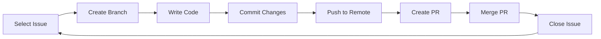
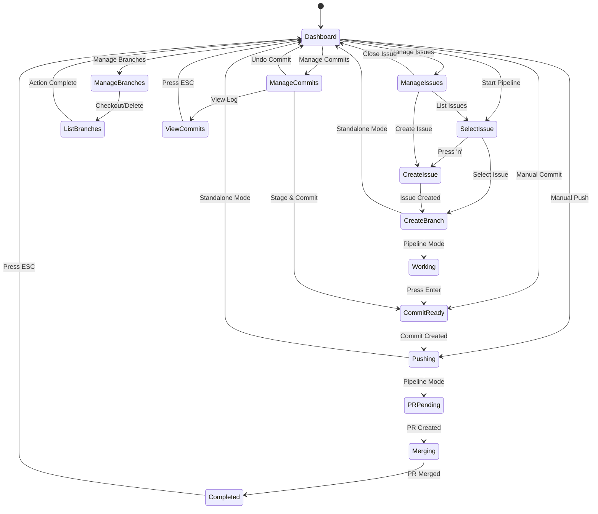
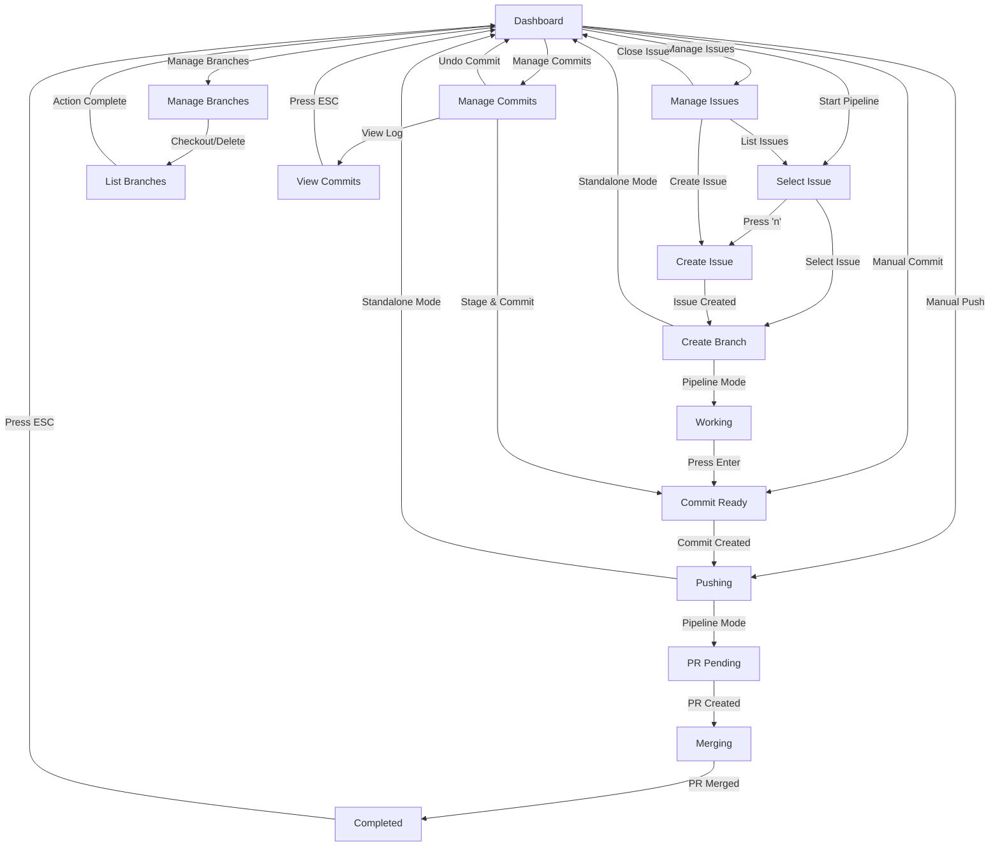
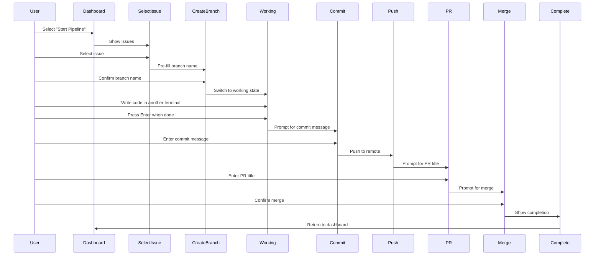
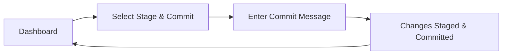
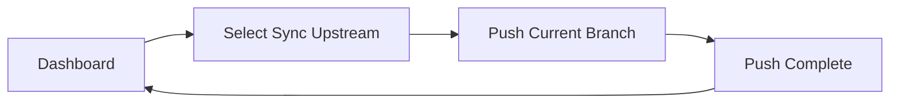
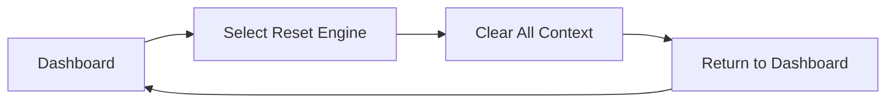
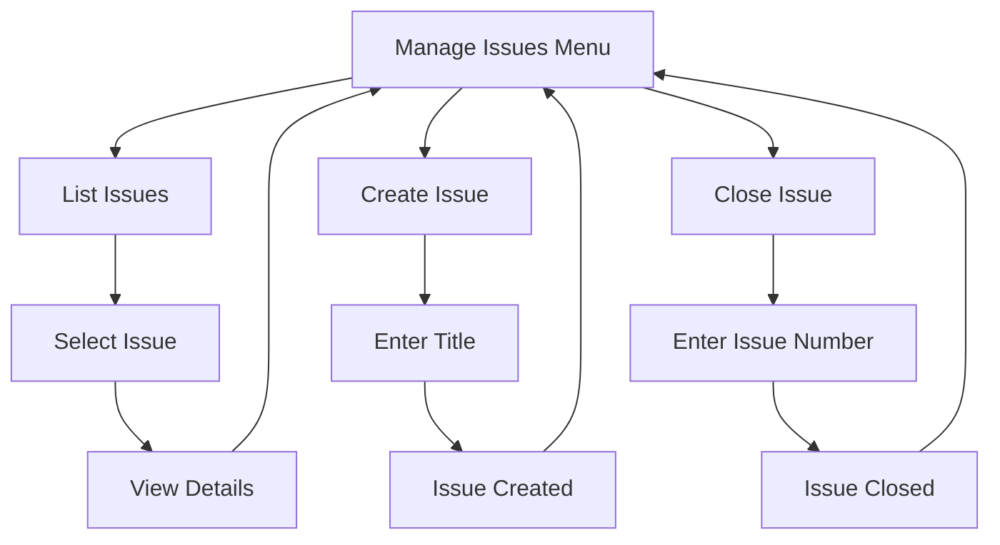
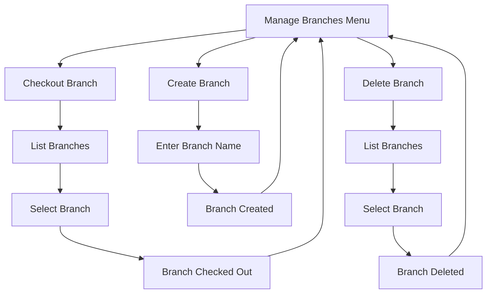
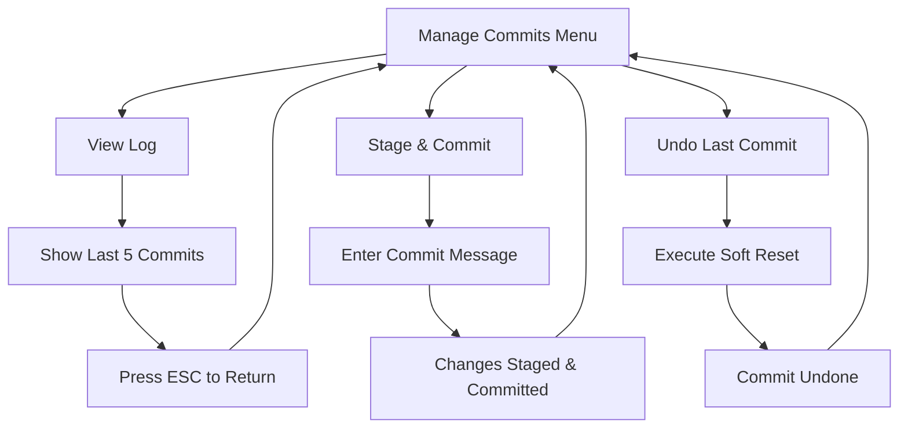

# Workflow Guide

This document provides a comprehensive guide to the EasyFlow workflow automation system, including the state machine, usage patterns, and best practices.

## Table of Contents

- [Workflow Overview](#workflow-overview)
- [State Machine](#state-machine)
- [Pipeline Mode](#pipeline-mode)
- [Standalone Mode](#standalone-mode)
- [CRUD Operations](#crud-operations)
- [Usage Examples](#usage-examples)
- [Best Practices](#best-practices)
- [Troubleshooting](#troubleshooting)

---

## Workflow Overview

EasyFlow provides two primary modes of operation:

1. **Pipeline Mode**: Automated end-to-end workflow from issue to merge
2. **Standalone Mode**: Individual operations for specific tasks

### Core Workflow Loop



### Workflow States



---

## State Machine

### State Definitions

| State | Description | Required Context |
|-------|-------------|------------------|
| `StateDashboard` | Main menu display | None |
| `StateSelectIssue` | Issue selection for pipeline | None |
| `StateCreateIssue` | New issue creation | None |
| `StateCreateBranch` | Branch naming | `ActiveIssueNumber` |
| `StateWorking` | Code editing phase | `BranchName` |
| `StateCommitReady` | Commit message input | `BranchName` |
| `StatePushing` | Pushing to remote | `BranchName` |
| `StatePRPending` | PR creation input | `BranchName` |
| `StateMerging` | Merge authorization | `PullRequestURL` |
| `StateCompleted` | Pipeline completion | All context |
| `StateManageIssues` | Issue management submenu | None |
| `StateManageBranches` | Branch management submenu | None |
| `StateManageCommits` | Commit management submenu | None |
| `StateListBranches` | Branch selection list | None |
| `StateViewCommits` | Commit log display | None |

### State Transitions



### Validation Rules

The workflow engine enforces validation rules to prevent invalid state transitions:

```go
// Cannot create branch without issue
case StateCreateBranch:
    if e.Ctx.ActiveIssueNumber == 0 {
        return fmt.Errorf("cannot initialize branch mapping: no issue selected")
    }

// Cannot commit without branch
case StateCommitReady:
    if e.Ctx.BranchName == "" {
        return fmt.Errorf("cannot prepare commit: no working branch active")
    }

// Cannot create PR without branch
case StatePRPending:
    if e.Ctx.BranchName == "" {
        return fmt.Errorf("cannot initiate PR build sequence: missing working branch")
    }

// Cannot merge without PR
case StateMerging:
    if e.Ctx.PullRequestURL == "" {
        return fmt.Errorf("cannot merge: no pull request URL detected")
    }
```

---

## Pipeline Mode

Pipeline mode provides an automated end-to-end workflow from issue selection to merge.

### Pipeline Flow



### Pipeline Steps

1. **Select Issue**
   - Browse open issues from repository
   - Press `n` to create new issue on-the-fly
   - Select existing issue to work on

2. **Create Branch**
   - Branch name auto-filled as `issue-{number}`
   - Customize branch name if desired
   - Branch created and checked out automatically

3. **Working**
   - Switch to another terminal to write code
   - Make changes to files
   - Press Enter when ready to commit

4. **Commit**
   - All changes automatically staged (`git add .`)
   - Enter commit message
   - Commit created locally

5. **Push**
   - Changes pushed to remote automatically
   - Upstream tracking set automatically

6. **Create PR**
   - PR title auto-filled with issue title
   - Customize PR title if desired
   - PR body auto-generated with issue reference

7. **Merge**
   - Review merge actions
   - Confirm to merge
   - Branch deleted automatically
   - Issue closed automatically

8. **Complete**
   - Success message displayed
   - Press ESC to return to dashboard

### Pipeline Advantages

- **Automated**: Minimal manual intervention
- **Guided**: Clear step-by-step progression
- **Safe**: Validation prevents errors
- **Fast**: No context switching between tools
- **Consistent**: Standardized workflow

---

## Standalone Mode

Standalone mode allows individual operations without the full pipeline.

### Standalone Operations

#### Manual Commit



**Use Case**: Quick commit without full pipeline

**Steps**:
1. Select "Stage & Commit Local Modifications" from dashboard
2. Enter commit message
3. Changes automatically staged and committed
4. Return to dashboard

#### Manual Push



**Use Case**: Push existing commits without pipeline

**Steps**:
1. Select "Sync Tracked Upstream Modifications" from dashboard
2. Current branch pushed to remote
3. Upstream tracking set automatically
4. Return to dashboard

#### Reset State



**Use Case**: Clear stuck state or start fresh

**Steps**:
1. Select "Reset Context State Engine" from dashboard
2. All context cleared (issue, branch, PR)
3. Return to clean dashboard state

---

## CRUD Operations

EasyFlow provides CRUD (Create, Read, Update, Delete) operations for issues, branches, and commits.

### Issue Management



#### List Issues

- Displays all open issues from repository
- Shows issue number and title
- Navigate with ↑/↓ or j/k
- Select issue to work on
- Press `n` to create new issue

#### Create Issue

- Enter issue title
- Issue created on GitHub
- Issue number returned
- Auto-advances to branch creation

#### Close Issue

- Enter issue number
- Issue closed on GitHub
- Confirmation displayed
- Returns to dashboard

### Branch Management



#### Checkout Branch

- Lists all local branches
- Navigate with ↑/↓ or j/k
- Select branch to checkout
- Branch switched immediately

#### Create Branch

- Enter custom branch name
- Branch sanitized automatically
- Branch created and checked out
- Returns to dashboard

#### Delete Branch

- Lists all local branches
- Navigate with ↑/↓ or j/k
- Select branch to delete
- Safe deletion with verification

### Commit Management



#### View Log

- Displays last 5 commit messages
- Shows commit hash and message
- Press ESC to return to dashboard

#### Stage & Commit

- All changes automatically staged
- Enter commit message
- Commit created locally
- Returns to dashboard

#### Undo Last Commit

- Executes `git reset --soft HEAD~1`
- Changes preserved in working directory
- Commit removed from history
- Returns to dashboard

---

## Usage Examples

### Example 1: Complete Pipeline

**Scenario**: Fix a bug reported in issue #42

```bash
# Run EasyFlow
easyflow

# In the UI:
1. Select "🚀 Start Pipeline Work Loop"
2. Navigate to issue #42: "Fix authentication timeout"
3. Press Enter to select
4. Branch name auto-filled: "issue-42"
5. Press Enter to confirm branch
6. Switch to another terminal to write code
7. Make changes to fix the bug
8. Return to EasyFlow, press Enter
9. Enter commit message: "Fix authentication timeout error"
10. Wait for push to complete
11. PR title auto-filled: "Fix authentication timeout"
12. Press Enter to create PR
13. Review merge actions
14. Press Enter to merge
15. Success! Issue #42 closed automatically
16. Press ESC to return to dashboard
```

### Example 2: Quick Commit

**Scenario**: Quick commit without full pipeline

```bash
# Run EasyFlow
easyflow

# In the UI:
1. Select "💾 Stage & Commit Local Modifications"
2. Enter commit message: "Update documentation"
3. Changes staged and committed
4. Return to dashboard
```

### Example 3: Branch Management

**Scenario**: Create and switch to a feature branch

```bash
# Run EasyFlow
easyflow

# In the UI:
1. Select "🌿 Manage Branches Menu"
2. Select "Create Custom Local Branch"
3. Enter branch name: "feature-user-auth"
4. Branch created and checked out
5. Press ESC to return to dashboard
```

### Example 4: Issue Management

**Scenario**: Create a new issue for a feature request

```bash
# Run EasyFlow
easyflow

# In the UI:
1. Select "🐛 Manage Issues Menu"
2. Select "Create Tracker Issue"
3. Enter issue title: "Add OAuth2 support"
4. Issue created on GitHub
5. Press ESC to return to dashboard
```

### Example 5: View Commit History

**Scenario**: Check recent commits on current branch

```bash
# Run EasyFlow
easyflow

# In the UI:
1. Select "💾 Manage Commits Menu"
2. Select "View Recent Commit Log"
3. View last 5 commits
4. Press ESC to return to dashboard
```

---

## Best Practices

### Workflow Best Practices

1. **Use Pipeline Mode for Complete Features**
   - Ideal for new features or bug fixes
   - Ensures proper issue tracking
   - Automates cleanup (branch deletion, issue closing)

2. **Use Standalone Mode for Quick Tasks**
   - Quick commits without full workflow
   - Manual pushes when needed
   - Reset state when stuck

3. **Create Descriptive Branch Names**
   - Use issue numbers: `issue-123`
   - Use descriptive names: `feature-auth-fix`
   - Avoid special characters

4. **Write Clear Commit Messages**
   - Describe what and why, not how
   - Use present tense: "Fix bug" not "Fixed bug"
   - Keep messages concise but informative

5. **Review Before Merging**
   - Check PR title and body
   - Ensure all changes are committed
   - Verify issue is properly referenced

### Keyboard Shortcuts

| Key | Action |
|-----|--------|
| `↑/↓` or `j/k` | Navigate menus |
| `Enter` | Select option / Advance |
| `Esc` | Return to dashboard / Reset |
| `q` or `Ctrl+C` | Quit application |
| `n` | Create new issue (in issue selection) |

### Error Handling

1. **Git Not Found**
   - Install Git: `brew install git` (macOS)
   - Verify installation: `git --version`

2. **GitHub CLI Not Found**
   - Install GitHub CLI: `brew install gh` (macOS)
   - Verify installation: `gh --version`

3. **Not a Git Repository**
   - Navigate to a git repository
   - Initialize if needed: `git init`

4. **No Remote Origin**
   - Add remote: `git remote add origin <url>`
   - Verify remote: `git remote -v`

5. **GitHub Auth Missing**
   - Authenticate: `gh auth login`
   - Verify auth: `gh auth status`

---

## Troubleshooting

### Common Issues

#### Issue: Stuck in Loading State

**Symptoms**: Spinner keeps spinning, no progress

**Solutions**:
- Press `Esc` to reset to dashboard
- Check network connection
- Verify GitHub CLI is authenticated
- Check for GitHub API rate limits

#### Issue: Branch Creation Fails

**Symptoms**: Error when creating branch

**Solutions**:
- Verify branch name is valid
- Check if branch already exists
- Ensure you have write permissions
- Check Git remote configuration

#### Issue: Push Fails

**Symptoms**: Error when pushing to remote

**Solutions**:
- Check network connection
- Verify remote URL is correct
- Ensure you have push permissions
- Check for merge conflicts

#### Issue: PR Creation Fails

**Symptoms**: Error when creating pull request

**Solutions**:
- Verify branch is pushed to remote
- Check PR title is not empty
- Ensure you have PR creation permissions
- Check for existing PR for branch

#### Issue: Merge Fails

**Symptoms**: Error when merging PR

**Solutions**:
- Verify PR exists and is mergeable
- Check for merge conflicts
- Ensure you have merge permissions
- Check branch protection rules

### Debug Mode

To enable debug output, set environment variable:

```bash
export EASYFLOW_DEBUG=1
easyflow
```

This will print detailed error messages and stack traces.

### Getting Help

If you encounter issues not covered here:

1. Check the [Troubleshooting Guide](troubleshooting.md)
2. Review [Architecture Documentation](architecture.md)
3. Check [Module Documentation](modules.md)
4. Open an issue on GitHub

---

## Advanced Usage

### Custom Layout Configuration

Modify `internal/config/config.go` to customize UI layout:

```go
func DefaultLayout() LayoutConfig {
    return LayoutConfig{
        MenuSpacing: 2,  // Tighter spacing
        ColumnWidth: 60, // Wider columns
    }
}
```

### Adding Custom Menu Items

Add new menu options in `internal/ui/menu.go`:

```go
{
    Title:       "Custom Action",
    Description: "Your custom action description",
}
```

Then handle the selection in `internal/ui/update.go`:

```go
case 7: // Custom action index
    // Your custom logic here
```

### Extending Workflow States

Add new states in `internal/workflow/state.go`:

```go
const (
    // ... existing states ...
    StateCustomAction State = iota
)
```

Add validation in `internal/workflow/workflow.go`:

```go
case StateCustomAction:
    // Your validation logic
```

Add UI handling in `internal/ui/update.go`:

```go
case workflow.StateCustomAction:
    // Your UI handling logic
```

Add view rendering in `internal/ui/view.go`:

```go
case workflow.StateCustomAction:
    // Your view rendering logic
```

---

**Related Documentation**:
- [Architecture Overview](architecture.md) - System architecture
- [Module Documentation](modules.md) - Component details
- [API Reference](api.md) - Complete API documentation
- [Troubleshooting](troubleshooting.md) - Common issues and solutions
